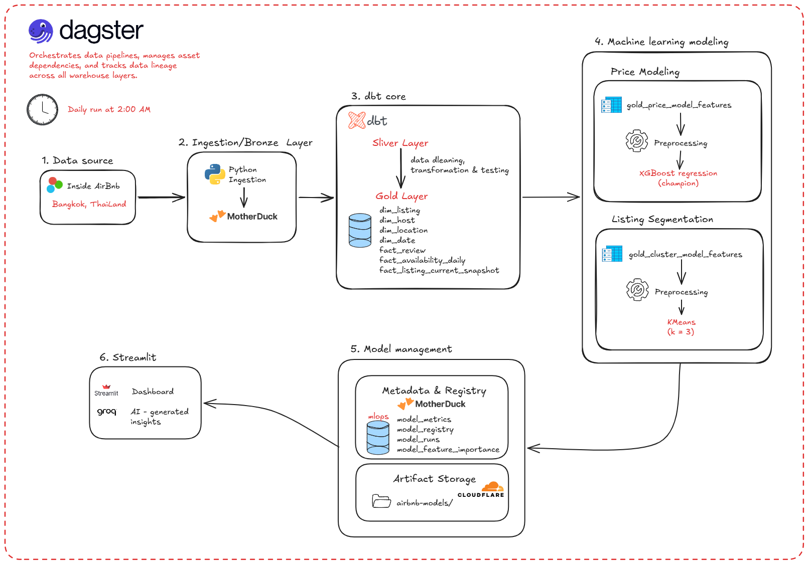

# Airbnb Analytics Platform

An end-to-end data platform analyzing Airbnb Bangkok listings, integrating Data Warehousing, Machine Learning, LLM insights, and a Streamlit dashboard.



---

## BẢN TIẾNG VIỆT (VIETNAMESE VERSION)

### 1. Giới thiệu dự án
Hệ thống phân tích dữ liệu Airbnb Bangkok theo mô hình hiện đại (Modern Data Stack):
- **Data Ingestion**: Nạp dữ liệu thô từ local vào **MotherDuck** (Cloud DuckDB).
- **Data Transformation (dbt)**: Chuyển đổi dữ liệu qua 3 lớp: Bronze (Thô) -> Silver (Lọc sạch, chuẩn hóa) -> Gold (Tạo Marts, Fact/Dimension phục vụ phân tích).
- **Machine Learning (ml)**: Huấn luyện mô hình dự đoán giá phòng (Regression) và phân cụm phân khúc thị trường (K-Means Clustering).
- **Generative AI (llm)**: Tích hợp mô hình Groq LLM để phân tích xu hướng thị trường, đề xuất chiến lược thâm nhập và rủi ro.
- **Dashboard (app)**: Giao diện Streamlit tương tác giúp trực quan hóa KPI, bản đồ phân bố phòng, dự báo giá phòng và SHAP explainability.

---

### 2. Yêu cầu hệ thống
Trước khi bắt đầu, máy tính của bạn cần cài đặt:
1. **Python 3.11 trở lên**
2. **uv** (Bộ quản lý thư viện Python siêu tốc): [Hướng dẫn cài đặt uv](https://github.com/astral-sh/uv)
3. Tài khoản **MotherDuck** và API token (Tru cập [MotherDuck](https://motherduck.com/) để đăng ký miễn phí)
4. API Key của **Groq** (Truy cập [Groq Console](https://console.groq.com/) để lấy Key miễn phí)

---

### 3. Hướng dẫn thiết lập từng bước (A - Z)

#### Bước 1: Sao chép mã nguồn (Clone repository)
```bash
git clone <repository_url>
cd airbnb-analytics-platform
```

#### Bước 2: Cấu hình biến môi trường (`.env`)
Tạo file `.env` từ file ví dụ:
```bash
cp .env.example .env
```
Mở file `.env` vừa tạo và điền đầy đủ các thông tin:
```env
# MotherDuck
MOTHERDUCK_TOKEN=your_motherduck_token_here
MOTHERDUCK_DATABASE=airbnb_analytics

# OpenAI / LLM
GROQ_API_KEY=your_groq_api_key_here
LLM_MODEL=llama-3.1-8b-instant

# Streamlit
STREAMLIT_SERVER_PORT=8501
```

#### Bước 3: Cài đặt thư viện Python (Dùng uv)
Khởi tạo môi trường ảo và cài đặt tất cả dependencies tự động:
```bash
uv venv
uv sync
```
Môi trường ảo sẽ được tạo trong thư mục `.venv`. Kích hoạt môi trường (nếu cần chạy chay):
- **Windows**: `.venv\Scripts\activate`
- **macOS/Linux**: `source .venv/bin/activate`

#### Bước 4: Nạp dữ liệu vào MotherDuck (Ingestion)
Nạp tập dữ liệu Airbnb thô vào Database MotherDuck của bạn:
```bash
# Validate dữ liệu raw ở local
uv run python ingestion/validate_raw_data.py

# Nạp dữ liệu thô từ local lên MotherDuck
uv run python ingestion/load_to_motherduck.py
```

#### Bước 5: Chạy dbt để biến đổi dữ liệu (Data Transformation)
Xây dựng Data Warehouse dbt trên MotherDuck. dbt sẽ tự động liên kết tài khoản của bạn để chạy lệnh:
```bash
# Di chuyển vào thư mục dbt và chạy build (Bronze -> Silver -> Gold)
cd dbt
uv run dbt deps
uv run dbt build
cd ..
```
*Lưu ý: Đảm bảo dbt profiles đã được cấu hình trỏ đến MotherDuck database (hoặc cấu hình thông qua biến môi trường).*

#### Bước 6: Trích xuất Parquet phục vụ Dashboard Local
Để tăng hiệu năng đọc ghi dữ liệu local cho dashboard, chạy script trích xuất dữ liệu Gold layer thành các file Parquet:
```bash
uv run python scripts/export_gold_to_parquet.py
```

#### Bước 7: Huấn luyện mô hình Machine Learning (ML)
Chạy huấn luyện mô hình dự đoán giá và phân cụm:
```bash
# Huấn luyện mô hình dự toán giá phòng và SHAP explainability
uv run python ml/train_model.py

# Chạy phân cụm phân khúc Airbnb listings
# (Kết quả sẽ được ghi trực tiếp vào Gold layer và registry trên MotherDuck)
```

#### Bước 8: Chạy ứng dụng Streamlit Dashboard
Khởi chạy giao diện phân tích:
```bash
uv run streamlit run app/streamlit_dashboard.py
```
Mở trình duyệt truy cập: [http://localhost:8501](http://localhost:8501)

---

### 4. Quản lý mô hình (Registry & Promote Champion)
Mô hình sau khi huấn luyện xong sẽ nằm ở trạng thái `CANDIDATE`. Để đưa mô hình lên làm mô hình chính thức (`CHAMPION`), bạn có thể thực hiện thông qua **giao diện Model Lab** trên Dashboard hoặc chạy SQL sau trên MotherDuck:
```sql
BEGIN TRANSACTION;
UPDATE mlops.model_registry SET stage = 'ARCHIVED', is_active = FALSE WHERE model_name = 'price_model' AND stage = 'CHAMPION';
UPDATE mlops.model_registry SET stage = 'CHAMPION', is_active = TRUE, promoted_at = current_timestamp WHERE model_name = 'price_model' AND model_version = '<phiên_bản_mô_hình_cần_thăng_hạng>';
COMMIT;
```

---

### 5. Khởi chạy Pipeline điều phối dữ liệu với Dagster (Orchestration)
Dự án sử dụng **Dagster** làm công cụ điều phối (Orchestration) cho toàn bộ pipeline dữ liệu (bao gồm cả Ingestion, dbt build, ML training và batch prediction):
- Để khởi động môi trường lập trình Dagster (Dagster UI) cục bộ:
  ```bash
  uv run dagster dev -m orchestration.definitions
  ```
- Giao diện Dagster UI sẽ chạy tại địa chỉ mặc định: [http://localhost:3000](http://localhost:3000). Tại đây, bạn có thể kiểm tra đồ thị phụ thuộc dữ liệu (Asset Lineage Graph), chạy thủ công các Assets hoặc thiết lập lịch trình tự động (Schedules).

---
---

## ENGLISH VERSION

### 1. Project Overview
A complete data platform analyzing Airbnb Bangkok listings using the Modern Data Stack architecture:
- **Data Ingestion**: Loads raw local data into **MotherDuck** (Cloud DuckDB).
- **Data Transformation (dbt)**: Transforms data through 3 layers: Bronze (Raw) -> Silver (Cleaned & Standardized) -> Gold (Analytical Marts, Facts & Dimensions).
- **Machine Learning (ml)**: Trains pricing models (Regression) and listing segmentation (K-Means Clustering).
- **Generative AI (llm)**: Integrates Groq LLM to interpret market trends, advise entry strategies, and flag risks.
- **Dashboard (app)**: Interactive Streamlit UI displaying metrics, listing maps, pricing predictions, and SHAP explainability.

---

### 2. Prerequisites
Ensure you have the following installed on your machine:
1. **Python 3.11 or higher**
2. **uv** (Fast Python package installer): [How to install uv](https://github.com/astral-sh/uv)
3. A **MotherDuck** account and API token ([Sign up for free here](https://motherduck.com/))
4. A **Groq** API Key ([Get a free Groq Key here](https://console.groq.com/))

---

### 3. Step-by-Step Installation (A - Z)

#### Step 1: Clone the Repository
```bash
git clone <repository_url>
cd airbnb-analytics-platform
```

#### Step 2: Configure Environment Variables (`.env`)
Create your `.env` file from the template:
```bash
cp .env.example .env
```
Open the `.env` file and fill in your keys and connection settings:
```env
# MotherDuck
MOTHERDUCK_TOKEN=your_motherduck_token_here
MOTHERDUCK_DATABASE=airbnb_analytics

# OpenAI / LLM
GROQ_API_KEY=your_groq_api_key_here
LLM_MODEL=llama-3.1-8b-instant

# Streamlit
STREAMLIT_SERVER_PORT=8501
```

#### Step 3: Install Python Dependencies (Using uv)
Initialize the virtual environment and install all packages automatically:
```bash
uv venv
uv sync
```
The virtual environment will be created under `.venv`. Activate it using:
- **Windows**: `.venv\Scripts\activate`
- **macOS/Linux**: `source .venv/bin/activate`

#### Step 4: Run Data Ingestion
Load raw Airbnb data from your local folder into MotherDuck:
```bash
# Validate local raw data quality
uv run python ingestion/validate_raw_data.py

# Load raw data into MotherDuck
uv run python ingestion/load_to_motherduck.py
```

#### Step 5: Build dbt Models (Data Transformation)
Build the data warehouse structure on MotherDuck:
```bash
cd dbt
uv run dbt deps
uv run dbt build
cd ..
```

#### Step 6: Export Gold Data to Local Parquet
For fast local reads by the Streamlit dashboard, sync Gold tables to local parquet:
```bash
uv run python scripts/export_gold_to_parquet.py
```

#### Step 7: Train Machine Learning Models
Train regression and clustering models:
```bash
# Train price estimation models and generate SHAP values
uv run python ml/train_model.py
```

#### Step 8: Run Streamlit Dashboard
Launch the interactive dashboard locally:
```bash
uv run streamlit run app/streamlit_dashboard.py
```
Open your browser and navigate to: [http://localhost:8501](http://localhost:8501)

---

### 4. Model Promotion (Registry & Champion Promotion)
New models are registered in MotherDuck as `CANDIDATE`. You can promote a model to `CHAMPION` either through the **Model Lab UI** on the dashboard or by running this transaction in MotherDuck:
```sql
BEGIN TRANSACTION;
UPDATE mlops.model_registry SET stage = 'ARCHIVED', is_active = FALSE WHERE model_name = 'price_model' AND stage = 'CHAMPION';
UPDATE mlops.model_registry SET stage = 'CHAMPION', is_active = TRUE, promoted_at = current_timestamp WHERE model_name = 'price_model' AND model_version = '<model_version_to_promote>';
COMMIT;
```

---

### 5. Running Pipelines with Dagster (Orchestration)
The project integrates **Dagster** to orchestrate the entire end-to-end data pipeline (Ingestion, dbt building, ML retraining, and prediction updates):
- To launch the local Dagster development UI:
  ```bash
  uv run dagster dev -m orchestration.definitions
  ```
- Open your browser and navigate to: [http://localhost:3000](http://localhost:3000) to inspect the Asset Lineage Graph, trigger jobs manually, or review automated schedules.
